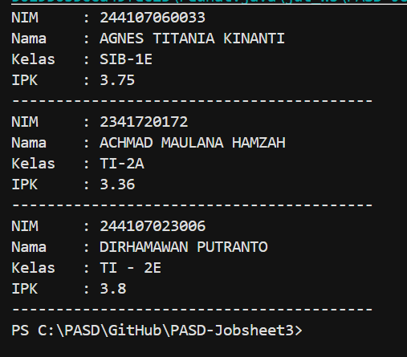

# JOBSHEET 3

# PERCOBAAN 

## - Percobaan 1 : Membuat Array dari Object, Mengisi dan Menampilkan

## - Percobaan 1 : Verifikasi Hasil Percobaan 



_Pertanyaan:_

1.  Berdasarkan uji coba 3.2, apakah class yang akan dibuat array of object harus selalu memiliki
atribut dan sekaligus method? Jelaskan!
2.  Apa yang dilakukan oleh kode program berikut?
    ```java
        Mahasiswa3[] arrayOfMahasiswa3 = new Mahasiswa3[3];
    ```
3.  Apakah class Mahasiswa memiliki konstruktor? Jika tidak, kenapa bisa dilakukan pemanggilan
konstruktur pada baris program berikut?
    ```java
        arrayOfMahasiswa3[0] = new Mahasiswa3();
    ```
4.  Apa yang dilakukan oleh kode program berikut?
    ```java
        arrayOfMahasiswa3[0] = new Mahasiswa3();
        arrayOfMahasiswa3[0].nim = "244107060033";
        arrayOfMahasiswa3[0].nama = "AGNES TITANIA KINANTI";
        arrayOfMahasiswa3[0].kelas = "SIB-1E";
        arrayOfMahasiswa3[0].ipk = (float) 3.75;
    ```
5.  Mengapa class Mahasiswa dan MahasiswaDemo dipisahkan pada uji coba 3.2?

_Jawaban:_

1.  Class yang akan dibuat array of object tidak harus punya method. Cukup punya class yang bisa dibuat objeknya (bida di-new) itu sudah cukup.
    - Pada kode : 
        - nim, nama, kelas, ipk : atribut
        - main() : method
        - Class Mahasiswa3 hanya punya atribut, tidak punya method, tapi tetap bisa dibuat array of object
    Jadi, tidak wajib ada method. Atribut saja sudah cukup untuk dibuat array of object
2.  Yang dilakukan kode tersebut yaitu :
    - Mendeklarasikan array of object : Mahasiswa3[] artinya membuat array yang berisi object bertipe Mahasiswa3.
    - Membuat array dengan kapasitas 3 : new Mahasiswa3[3] : membuar array yang bisa menampung 3 object Mahasiswa3.
    - Baris ini belum membuat object Mahasiswa3-nya.
3.  Pada class Mahasiswa3 memang tidak menuliskan konstruktor secara langsung. Namun, Java otomatis membuat default constructor (konstruktor kosong). Walaupun tidak ditulis, konstruktor tetap ada karena dibuat otomatis oleh Java.
4.  Yang dilakukan oleh program tersebut adalah : 
    - Membuat object baru Mahasiswa3
        - new Mahasiswa()
        - Lalu disimpan di indeks ke-0 array
    - Mengisi nilai atribut object tersebut, yaitu : 
        - nim diisi "244107060033"
        - nama diisi "AGNES TITANIA KINANTI"
        - kelas diisi "SIB-1E"
        - ipk diisi  3.75
    Jadi, kode tersebut membuat satu object Mahasiswa3 di array indeks 0 dan mengisi data (atribut) mahasiswa tersebut.
5.  Alasan class Mahasiswa dan MahasiswaDemo dipisahkan pada uji coba 3.2 adalah agar kode lebih terstruktur dan mudah dikelola.
    Penjelasan : 
    - Class Mahasiswa : Berfungsi sebagai model/data, menyimpan atribut
    - Class MahasiswaDemo : Berfungsi sebagai tempat menjalankan main() untuk membuat dan menguji object.
