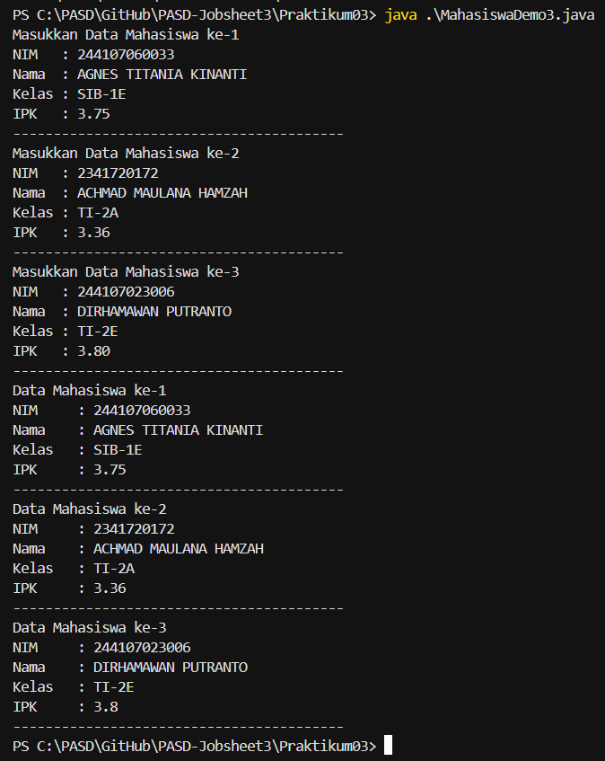
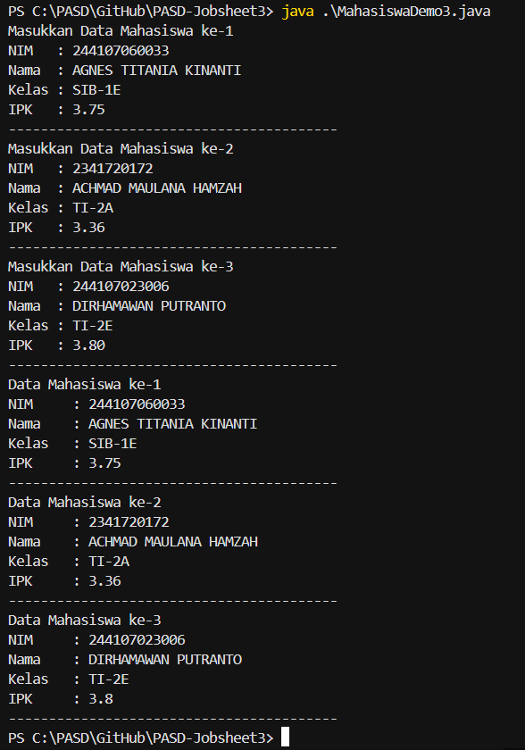
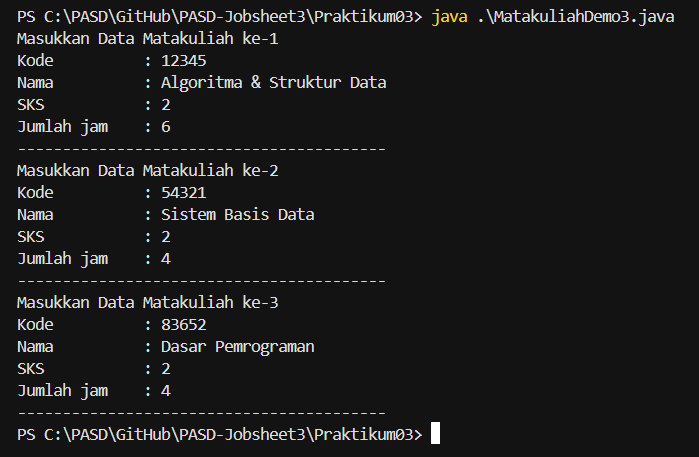
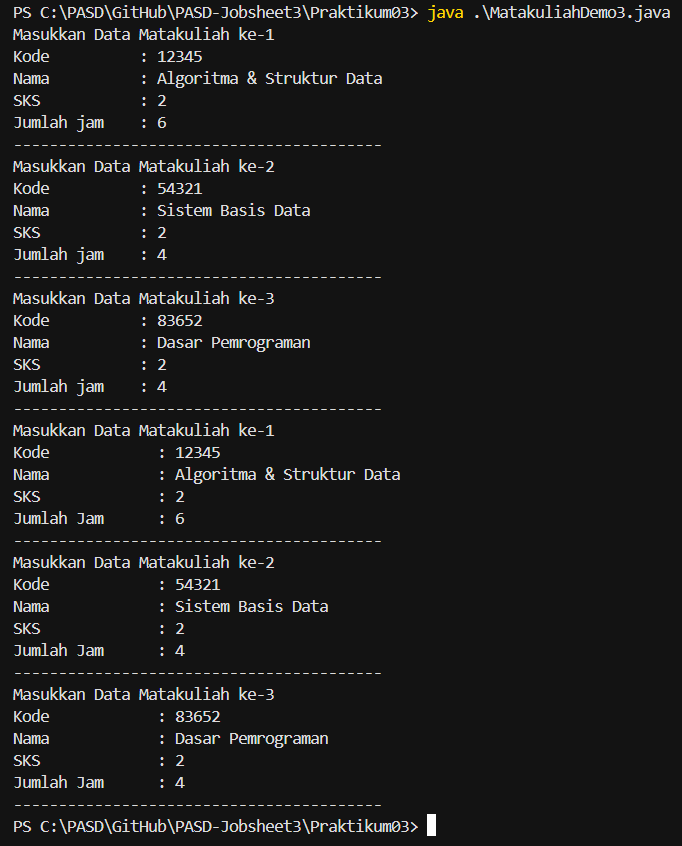
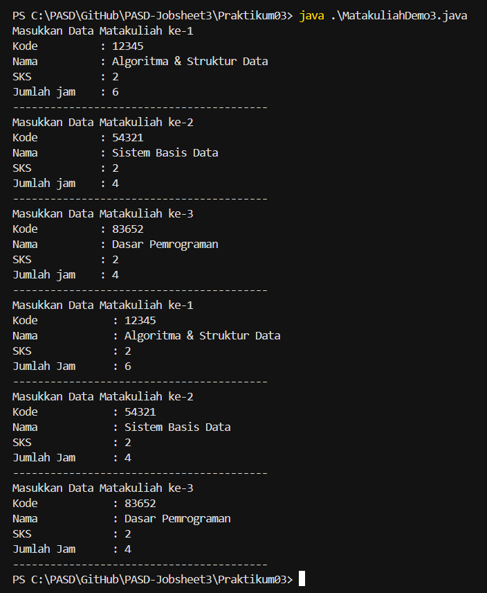
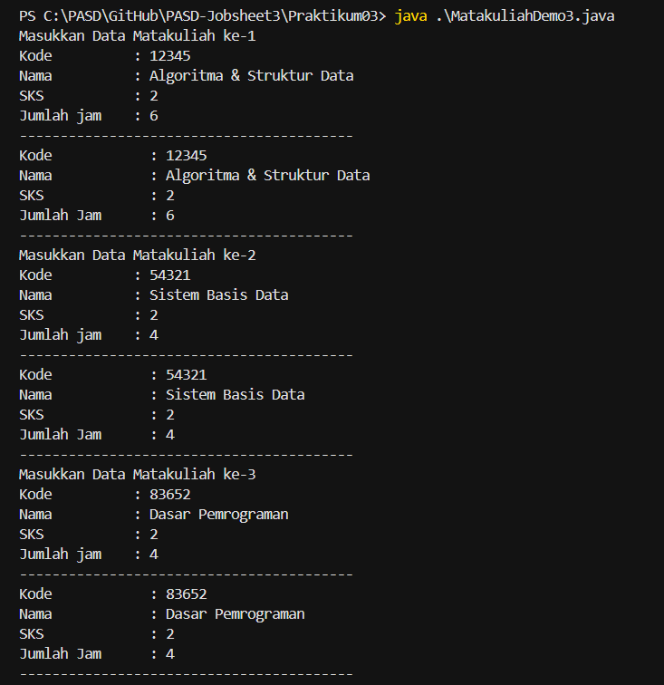
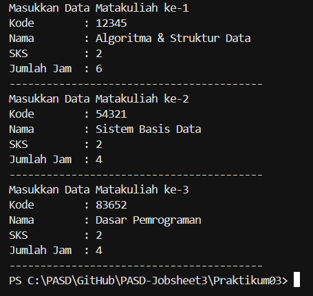
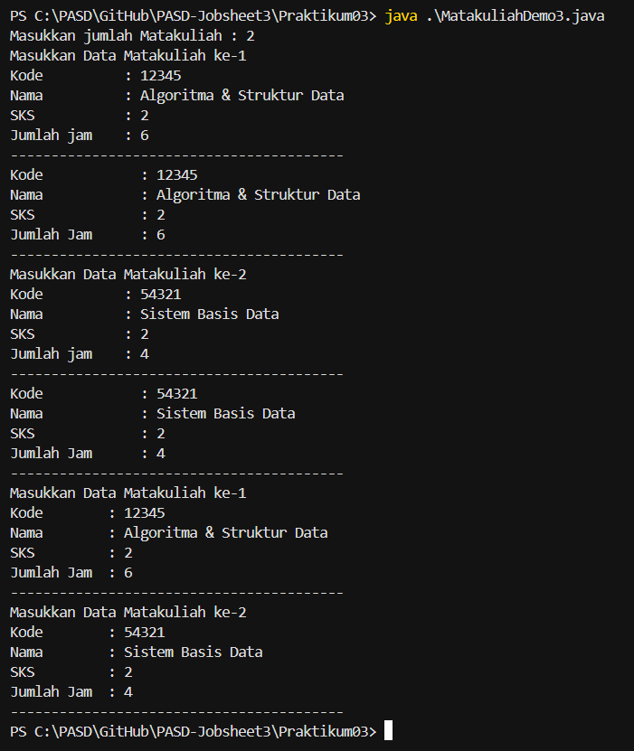

# JOBSHEET 3

# PERCOBAAN 

## - Percobaan 1 : Membuat Array dari Object, Mengisi dan Menampilkan

## - Percobaan 1 : Verifikasi Hasil Percobaan 


_Pertanyaan:_

1.  Berdasarkan uji coba 3.2, apakah class yang akan dibuat array of object harus selalu memiliki
atribut dan sekaligus method? Jelaskan!
2.  Apa yang dilakukan oleh kode program berikut?
    ```java
        Mahasiswa3[] arrayOfMahasiswa3 = new Mahasiswa3[3];
    ```
3.  Apakah class Mahasiswa memiliki konstruktor? Jika tidak, kenapa bisa dilakukan pemanggilan
konstruktur pada baris program berikut?
    ```java
        arrayOfMahasiswa3[0] = new Mahasiswa3();
    ```
4.  Apa yang dilakukan oleh kode program berikut?
    ```java
        arrayOfMahasiswa3[0] = new Mahasiswa3();
        arrayOfMahasiswa3[0].nim = "244107060033";
        arrayOfMahasiswa3[0].nama = "AGNES TITANIA KINANTI";
        arrayOfMahasiswa3[0].kelas = "SIB-1E";
        arrayOfMahasiswa3[0].ipk = (float) 3.75;
    ```
5.  Mengapa class Mahasiswa dan MahasiswaDemo dipisahkan pada uji coba 3.2?

_Jawaban:_

1.  Class yang akan dibuat array of object tidak harus punya method. Cukup punya class yang bisa dibuat objeknya (bida di-new) itu sudah cukup.
    - Pada kode : 
        - nim, nama, kelas, ipk : atribut
        - main() : method
        - Class Mahasiswa3 hanya punya atribut, tidak punya method, tapi tetap bisa dibuat array of object
    Jadi, tidak wajib ada method. Atribut saja sudah cukup untuk dibuat array of object
2.  Yang dilakukan kode tersebut yaitu :
    - Mendeklarasikan array of object : Mahasiswa3[] artinya membuat array yang berisi object bertipe Mahasiswa3.
    - Membuat array dengan kapasitas 3 : new Mahasiswa3[3] : membuar array yang bisa menampung 3 object Mahasiswa3.
    - Baris ini belum membuat object Mahasiswa3-nya.
3.  Pada class Mahasiswa3 memang tidak menuliskan konstruktor secara langsung. Namun, Java otomatis membuat default constructor (konstruktor kosong). Walaupun tidak ditulis, konstruktor tetap ada karena dibuat otomatis oleh Java.
4.  Yang dilakukan oleh program tersebut adalah : 
    - Membuat object baru Mahasiswa3
        - new Mahasiswa()
        - Lalu disimpan di indeks ke-0 array
    - Mengisi nilai atribut object tersebut, yaitu : 
        - nim diisi "244107060033"
        - nama diisi "AGNES TITANIA KINANTI"
        - kelas diisi "SIB-1E"
        - ipk diisi  3.75
    Jadi, kode tersebut membuat satu object Mahasiswa3 di array indeks 0 dan mengisi data (atribut) mahasiswa tersebut.
5.  Alasan class Mahasiswa dan MahasiswaDemo dipisahkan pada uji coba 3.2 adalah agar kode lebih terstruktur dan mudah dikelola.
    Penjelasan : 
    - Class Mahasiswa : Berfungsi sebagai model/data, menyimpan atribut
    - Class MahasiswaDemo : Berfungsi sebagai tempat menjalankan main() untuk membuat dan menguji object.

## - Percobaan 2 : Menerima Input Isian Array Menggunakan Looping 

## - Percobaan 2 : Verifikasi Hasil Percobaan 



_Pertanyaan:_

1.  Tambahkan method cetakInfo() pada class Mahasiswa kemudian modifikasi kode program pada langkah no 3.
2.  Misalkan Anda punya array baru bertipe array of Mahasiswa dengan nama myArrayOfMahasiswa. Mengapa kode berikut menyebabkan error?
    ```java
        Mahasiswa3[] myArrayofMahasiswa3 = new Mahasiswa3[3];
        myArrayofMahasiswa3[0].nim = "244107060033";
        myArrayofMahasiswa3[0].nama = "AGNES TITANIA KINANTI";
        myArrayofMahasiswa3[0].kelas = "SIB-1E";
        myArrayofMahasiswa3[0].ipk = (float) 3.75;
    ```

_Jawaban:_

1.  Code class Mahasiswa3 :
    ```java
        package Praktikum03;

        public class Mahasiswa3 {
            public String nim;
            public String nama;
            public String kelas;
            public float ipk;

            public void cetakInfo() {
                System.out.println("NIM     : " + nim);
                System.out.println("Nama    : " + nama);
                System.out.println("Kelas   : " + kelas);
                System.out.println("IPK     : " + ipk);
                System.out.println("-----------------------------------------");
            }
        }
    ```

    Code class MahasiswaDemo3 : 

    ```java
        import java.util.Scanner;

        import Praktikum03.Mahasiswa3;

        public class MahasiswaDemo3 {
            public static void main(String[] args) {
                Scanner sc = new Scanner(System.in);
                Mahasiswa3[] arrayOfMahasiswa3 = new Mahasiswa3[3];
                String dummy;

                for (int i = 0; i < 3; i++) {
                    arrayOfMahasiswa3[i] = new Mahasiswa3();

                    System.out.println("Masukkan Data Mahasiswa ke-" + (i+1));
                    System.out.print("NIM   : ");
                    arrayOfMahasiswa3[i].nim = sc.nextLine();
                    System.out.print("Nama  : ");
                    arrayOfMahasiswa3[i].nama = sc.nextLine();
                    System.out.print("Kelas : ");
                    arrayOfMahasiswa3[i].kelas = sc.nextLine();
                    System.out.print("IPK   : ");
                    dummy = sc.nextLine();
                    arrayOfMahasiswa3[i].ipk = Float.parseFloat(dummy);
                    System.out.println("-----------------------------------------");
                }
                for (int i = 0; i < 3; i++) {
                    System.out.println("Data Mahasiswa ke-" + (i+1));
                    arrayOfMahasiswa3[i].cetakInfo();
                }
                sc.close();
            }
        }
    ``` 

    Output : 



2.  Penjelasan : 
    - new Mahasiswa3[3] hanya membuat wadah array
    - Isi array masih null 
    - Harus new Mahasiswa3() dulu sebelum mengakses atribut
    - Jika tidak, pasti terjadi NullPointerException 

## - Percobaan 3 : Constructor Berparameter

## - Percobaan 3 : Verifikasi Hasil Percobaan 

#### Output sebelum dimodifikasi :



#### Output setelah dimodifikasi : 



_Pertanyaan:_

1.  Apakah suatu class dapat memiliki lebih dari 1 constructor? Jika iya, berikan contohnya
2.  Tambahkan method tambahData() pada class Matakuliah, kemudian gunakan method tersebut di class MatakuliahDemo untuk menambahkan data Matakuliah
3.  Tambahkan method cetakInfo() pada class Matakuliah, kemudian gunakan method tersebut di class MatakuliahDemo untuk menampilkan data hasil inputan di layar
4.  Modifikasi kode program pada class MatakuliahDemo agar panjang (jumlah elemen) dari array of object Matakuliah ditentukan oleh user melalui input dengan Scanner

_Jawaban:_

1.  Suatu class bisa memiliki lebih dari 1 constructor. Konsep ini disebut Constructor Overloading.
    - Syarat : 
        - Nama constructor harus sama dengan nama class 
        - Parameter harus berbeda (jumlah atau tipe datanya berbeda)
    - Contoh pada class Matakuliah3 : 
    ```java 
        package Praktikum03;

        public class Matakuliah3 {
            public String kode;
            public String nama;
            public int sks;
            public int jumlahJam;

            // Constructor 1 (lengkap)
            public Matakuliah3(String kode, String nama, int sks, int jumlahJam){
                this.kode = kode;
                this.nama = nama;
                this.sks = sks;
                this.jumlahJam = jumlahJam;
            }
            // Constructor 2 (tanpa jumlahJam)
            public Matakuliah3(String kode, String nama, int sks){
                this.kode = kode;
                this.nama = nama;
                this.sks = sks;
                this.jumlahJam = sks*2; // misalnya otomatis 2 jam per SKS
        }
    ```
2.  Code menambahkan method tambahData() pada class Matakuliah3 :

    ```java 
        package Praktikum03;

        public class Matakuliah3 {
            public String kode;
            public String nama;
            public int sks;
            public int jumlahJam;

            public Matakuliah3(){
            }

            public Matakuliah3(String kode, String nama, int sks, int jumlahJam){
                this.kode = kode;
                this.nama = nama;
                this.sks = sks;
                this.jumlahJam = jumlahJam;
            }

            public void tambahData(String kode, String nama, int sks, int jumlahJam){
                this.kode = kode;
                this.nama = nama;
                this.sks = sks;
                this.jumlahJam = jumlahJam;
            }
        }
    ```
    Code pada class MatakuliahDemo3 :

    ```java 
        package Praktikum03;
        import java.util.Scanner;

        public class MatakuliahDemo3 {
            public static void main(String[] args) {
                Scanner sc = new Scanner(System.in);
                Matakuliah3[] arrayOfMatakuliah3 = new Matakuliah3[3];
                String kode, nama, dummy;
                int sks, jumlahJam;

                for (int i = 0; i < 3; i++) {
                    System.out.println("Masukkan Data Matakuliah ke-" + (i+1));
                    System.out.print("Kode          : ");
                    kode = sc.nextLine();
                    System.out.print("Nama          : ");
                    nama = sc.nextLine();
                    System.out.print("SKS           : ");
                    dummy = sc.nextLine();
                    sks = Integer.parseInt(dummy);
                    System.out.print("Jumlah jam    : ");
                    dummy = sc.nextLine();
                    jumlahJam = Integer.parseInt(dummy);
                    System.out.println("-----------------------------------------");

                    arrayOfMatakuliah3[i] = new Matakuliah3();
                    arrayOfMatakuliah3[i].tambahData(kode, nama, sks, jumlahJam);
                }
                for (int i = 0; i < 3; i++) {
                    System.out.println("Masukkan Data Matakuliah ke-" + (i+1));
                    System.out.println("Kode            : "+ arrayOfMatakuliah3[i].kode);
                    System.out.println("Nama            : "+ arrayOfMatakuliah3[i].nama);
                    System.out.println("SKS             : "+ arrayOfMatakuliah3[i].sks);
                    System.out.println("Jumlah Jam      : "+ arrayOfMatakuliah3[i].jumlahJam);
                    System.out.println("-----------------------------------------");           
                }
                sc.close();
            }
        }
    ``` 
    
    Output : 



3.  Code menambahkan method cetakInfo() pada class Matakuliah3 :

    ```java 
        package Praktikum03;

        public class Matakuliah3 {
            public String kode;
            public String nama;
            public int sks;
            public int jumlahJam;

            public Matakuliah3(){
            }

            public Matakuliah3(String kode, String nama, int sks, int jumlahJam){
                this.kode = kode;
                this.nama = nama;
                this.sks = sks;
                this.jumlahJam = jumlahJam;
            }

            public void tambahData(String kode, String nama, int sks, int jumlahJam){
                this.kode = kode;
                this.nama = nama;
                this.sks = sks;
                this.jumlahJam = jumlahJam;
            }

            public void cetakInfo(){
                System.out.println("Kode            : " + kode);
                System.out.println("Nama            : " + nama);
                System.out.println("SKS             : " + sks);
                System.out.println("Jumlah Jam      : " + jumlahJam);
                System.out.println("-----------------------------------------");

            }
        }
    ```
    Code pada class MatakuliahDemo3 : 
    
    ```java
        package Praktikum03;
        import java.util.Scanner;

        public class MatakuliahDemo3 {
            public static void main(String[] args) {
                Scanner sc = new Scanner(System.in);
                Matakuliah3[] arrayOfMatakuliah3 = new Matakuliah3[3];
                String kode, nama, dummy;
                int sks, jumlahJam;

                for (int i = 0; i < 3; i++) {
                    System.out.println("Masukkan Data Matakuliah ke-" + (i+1));
                    System.out.print("Kode          : ");
                    kode = sc.nextLine();
                    System.out.print("Nama          : ");
                    nama = sc.nextLine();
                    System.out.print("SKS           : ");
                    dummy = sc.nextLine();
                    sks = Integer.parseInt(dummy);
                    System.out.print("Jumlah jam    : ");
                    dummy = sc.nextLine();
                    jumlahJam = Integer.parseInt(dummy);
                    System.out.println("-----------------------------------------");

                    arrayOfMatakuliah3[i] = new Matakuliah3();
                    arrayOfMatakuliah3[i].tambahData(kode, nama, sks, jumlahJam);
                    arrayOfMatakuliah3[i].cetakInfo();
                }
                for (int i = 0; i < 3; i++) {
                    System.out.println("Masukkan Data Matakuliah ke-" + (i+1));
                    System.out.println("Kode        : "+ arrayOfMatakuliah3[i].kode);
                    System.out.println("Nama        : "+ arrayOfMatakuliah3[i].nama);
                    System.out.println("SKS         : "+ arrayOfMatakuliah3[i].sks);
                    System.out.println("Jumlah Jam  : "+ arrayOfMatakuliah3[i].jumlahJam);
                    System.out.println("-----------------------------------------");           
                }
                sc.close();
            }
        }
    ```

    Output : 

    

    

4.  Modifikasi kode pada class MatakuliahDemo3 agar jumlah elemen dari array of object Matakuliah3 ditentukan oleh user melalui input dengan Sacanner : 
    ```java
        package Praktikum03;
        import java.util.Scanner;

        public class MatakuliahDemo3 {
            public static void main(String[] args) {
                Scanner sc = new Scanner(System.in);
                
                System.out.print("Masukkan jumlah Matakuliah : ");
                int jumlah = Integer.parseInt(sc.nextLine());

                Matakuliah3[] arrayOfMatakuliah3 = new Matakuliah3[jumlah];

                String kode, nama, dummy;
                int sks, jumlahJam;

                for (int i = 0; i < jumlah; i++) {
                    System.out.println("Masukkan Data Matakuliah ke-" + (i+1));
                    System.out.print("Kode          : ");
                    kode = sc.nextLine();
                    System.out.print("Nama          : ");
                    nama = sc.nextLine();
                    System.out.print("SKS           : ");
                    dummy = sc.nextLine();
                    sks = Integer.parseInt(dummy);
                    System.out.print("Jumlah jam    : ");
                    dummy = sc.nextLine();
                    jumlahJam = Integer.parseInt(dummy);
                    System.out.println("-----------------------------------------");

                    arrayOfMatakuliah3[i] = new Matakuliah3();
                    arrayOfMatakuliah3[i].tambahData(kode, nama, sks, jumlahJam);
                    arrayOfMatakuliah3[i].cetakInfo();
                }
                for (int i = 0; i < jumlah; i++) {
                    System.out.println("Masukkan Data Matakuliah ke-" + (i+1));
                    System.out.println("Kode        : "+ arrayOfMatakuliah3[i].kode);
                    System.out.println("Nama        : "+ arrayOfMatakuliah3[i].nama);
                    System.out.println("SKS         : "+ arrayOfMatakuliah3[i].sks);
                    System.out.println("Jumlah Jam  : "+ arrayOfMatakuliah3[i].jumlahJam);
                    System.out.println("-----------------------------------------");           
                }
                sc.close();
            }
        }
    ```

    Output : 

    


